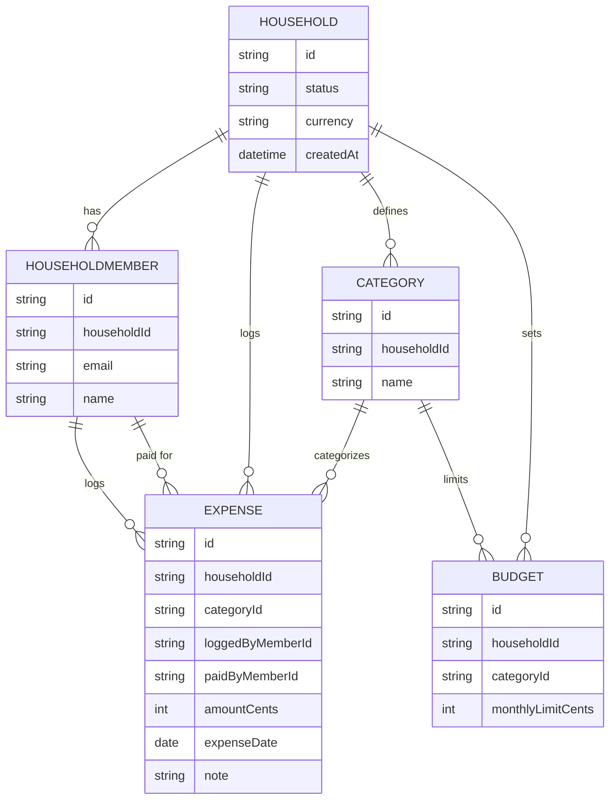

# Domain model

The household is the unit everything else belongs to: its two members share
one set of expenses, categories and budgets.

A `HOUSEHOLD` starts `pending` when its creator signs up and becomes `active`
once the invited partner accepts. Every `EXPENSE` belongs to exactly one
`CATEGORY` and records both who logged it and who paid; a `BUDGET` is a
monthly limit on one category.