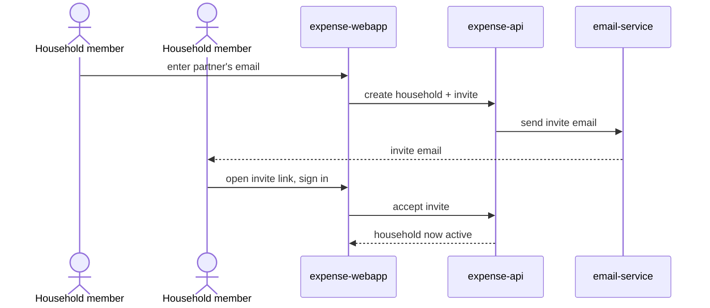

# Invite and join household

A household member invites their partner by email; the partner accepts and
the two accounts become one shared household.

```mermaid
sequenceDiagram
    actor Member as Household member
    actor Partner as Household member
    participant expense-webapp
    participant expense-api
    participant email-service

    Member->>expense-webapp: enter partner's email
    expense-webapp->>expense-api: create household + invite
    expense-api->>email-service: send invite email
    email-service-->>Partner: invite email
    Partner->>expense-webapp: open invite link, sign in
    expense-webapp->>expense-api: accept invite
    expense-api-->>expense-webapp: household now active
```