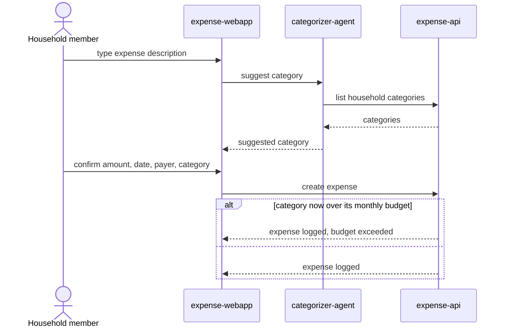

# Log and categorize an expense

A household member logs an expense; the agent suggests its category, and the
member sees an alert if the category's monthly budget is now exceeded.

```mermaid
sequenceDiagram
    actor Member as Household member
    participant expense-webapp
    participant categorizer-agent
    participant expense-api

    Member->>expense-webapp: type expense description
    expense-webapp->>categorizer-agent: suggest category
    categorizer-agent->>expense-api: list household categories
    expense-api-->>categorizer-agent: categories
    categorizer-agent-->>expense-webapp: suggested category
    Member->>expense-webapp: confirm amount, date, payer, category
    expense-webapp->>expense-api: create expense
    alt category now over its monthly budget
        expense-api-->>expense-webapp: expense logged, budget exceeded
    else
        expense-api-->>expense-webapp: expense logged
    end
```